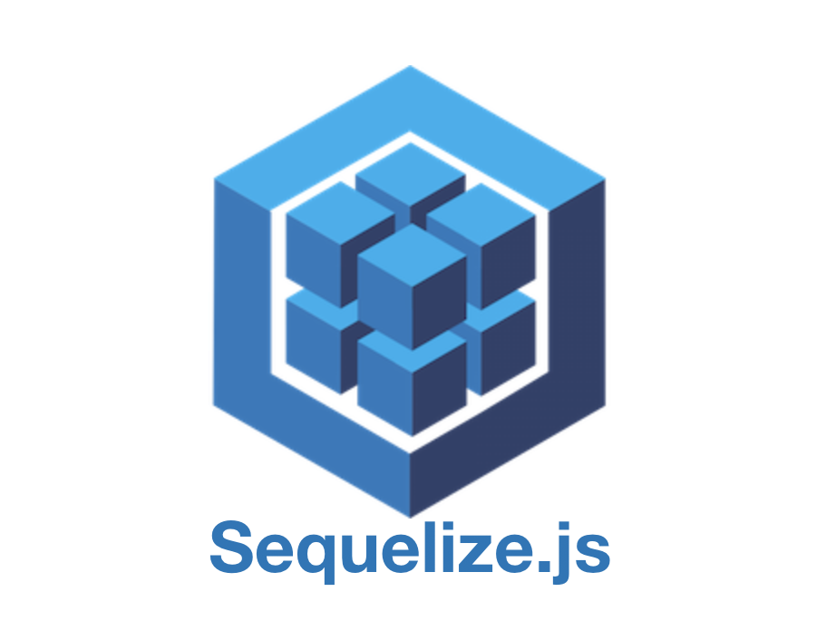

# Node.js

- [Node.js](#nodejs)
  - [Introduction](#introduction)
  - [Integrations](#integrations)
  - [Installing it](#installing-it)
    - [From source](#from-source)
    - [Verify Installation](#verify-installation)

## Introduction

sqlcommenter is a suite of plugins/middleware/wrappers to augment SQL statements from ORMs/Querybuilders with comments that can be used later to correlate user code with SQL statements.

## Integrations

sqlcommenter-nodejs provides support for the following:

[](knex)

[](express)

[](sequelize)


<style>
    img[src*='/knex-logo.png'], img[src*='/sequelize-logo.png'], img[src*='/express_js-logo.png'] {
        max-width: 30%;
        float: left;
        margin: 0 1%;
    }
     img[src*='/sequelize-logo.png'] {
        float:none;
        clear:right;    
    }
</style>

## Installing it
sqlcommenter-nodejs can installed in a couple of ways:

### From source

The first step is to clone the repository. This can be done with [git](https://git-scm.com/book/en/v2/Getting-Started-Installing-Git) by running:
```shell
git clone https://github.com/open-telemetry/opentelemetry-sqlcommenter.git
```
Inspect the source code and note the path to the package you want installed.

```shell 
sqlcommenter/nodejs/sqlcommenter-nodejs
└── packages
    ├── knex
    │   ├── index.js
    │   ├── package.json
    │   ├── test
    │   └── ...
    └── sequelize
        ├── index.js
        ├── package.json
        ├── test
        └── ...
```
Each folder in the `packages` directory can be installed by running 
```shell
npm install <path/to/package>
```
for example to install `@opentelemetry/sqlcommenter-knex` in a given location, run `npm install /path/to/sqlcommenter-nodejs/packages/knex`. Same for every package(folder) in the `packages` directory.
```shell
# install 
> npm install /path/to/sqlcommenter-nodejs/packages/knex

+ @opentelemetry/sqlcommenter-knex@0.0.1
```

### Verify Installation
If package is properly installed, running `npm list <package-name>` will output details of the package. Let's verify the installation of `@opentelemetry/sqlcommenter-knex` below:
```shell
# verify
> npm list @opentelemetry/sqlcommenter-knex

project@0.0.0 path/to/project
└── @opentelemetry/sqlcommenter-knex@0.0.1  -> /path/to/sqlcommenter-nodejs/packages/knex
```
Inspecting the `package.json` file after installation should also show the installed pacakge.